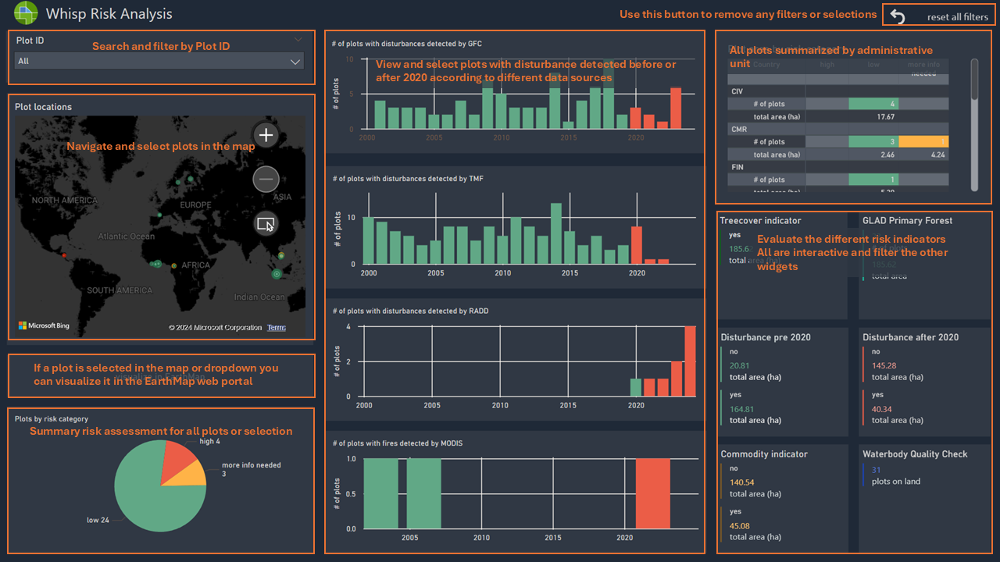
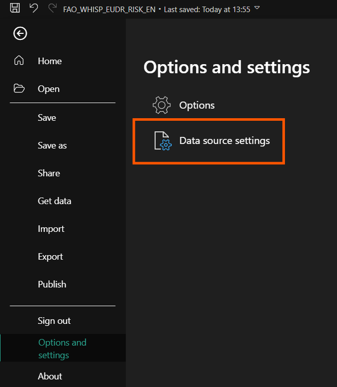
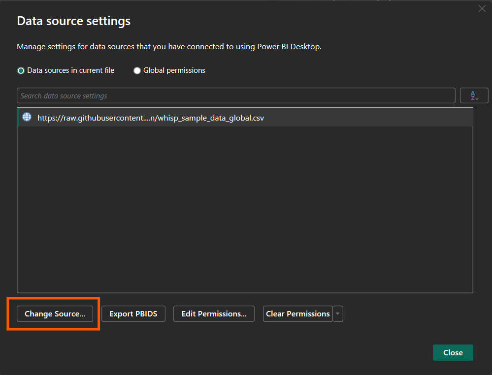
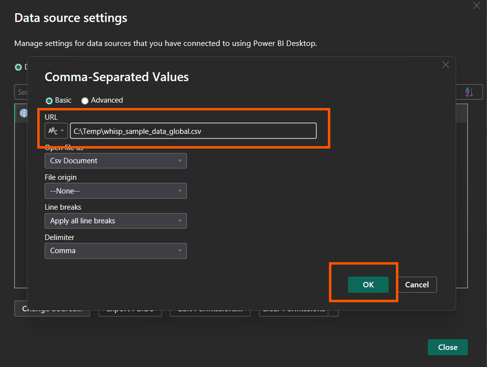
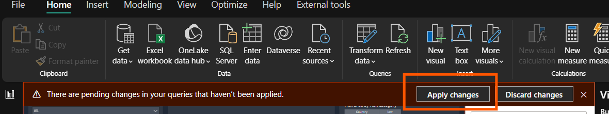
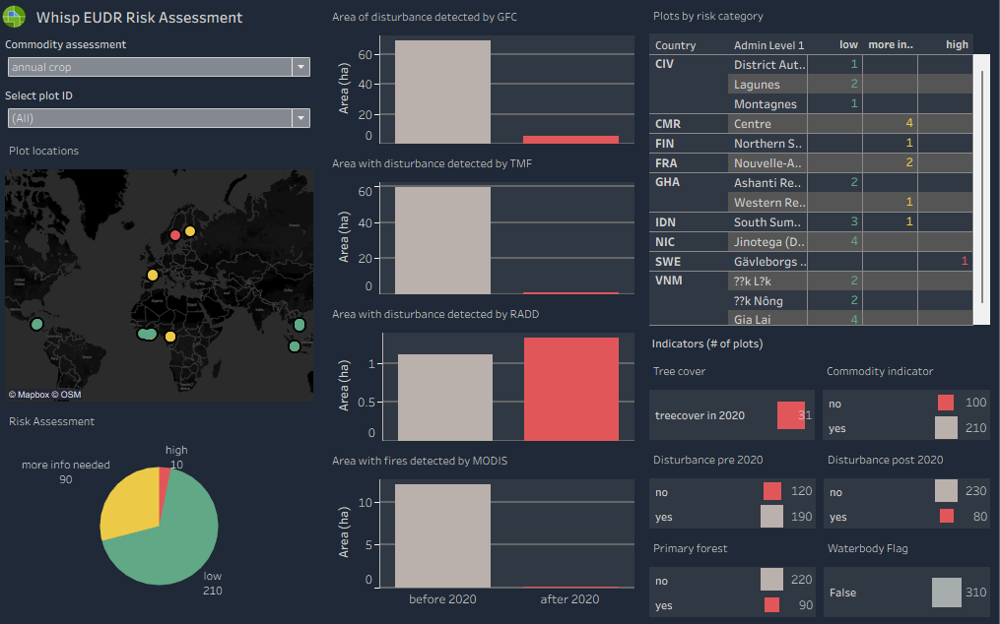

# Whisp Dashboards

The Whisp dashboard allows you to display statistics on deforestation risk in your plots in a **clear and interactive manner**.

Through the [Whisp App](https://whisp.openforis.org/submit-geometry), risk analysis of your plots based on open source spatial data has been made easy and convenient. Upload your geometries as GeoJSONs in EPSG 4326 projection in the Whisp app and make sure to tick the box "Generate GeoIds". The output statistics from the Whisp App are delivered in the well-established and interoperable CSV format that can be used for further analysis in a multitude of programs, including ***MS PowerBI***, ***Tableau*** or other software of choice.

Here you can find dashboard templates that can be adapted and updated with your individual risk analysis outputs from Whisp App.  These dashboards provide users with a clear overview of deforestation risk indicators according to different data sources in their plot. 

The default ***MS PowerBI*** dashboard, including all widgets, filters and power queries to prepare the data to be visualized. You can view the template with the sample global data (click the image below to open the interactive dashboard in a new tab):

&nbsp;
&nbsp;
&nbsp;

Each widget is interactive and provides different functionalities to filter and explore your Whisp outputs:

## How to use it

&nbsp;
&nbsp;
&nbsp;

First, make sure you have Power Bi installed on your computer and download the PowerBI template file from GitHub [FAO_Whisp_risk_EN.pbit](FAO_Whisp_risk_EN.pbit) or this [Google Link](https://drive.google.com/file/d/15lJ3UTkr1hD1GiUgCy5oCpvRjz1oWKB1/view?usp=drive_link). Open it.

&nbsp;
&nbsp;
&nbsp;

---

The Power Bi template will connect to the online [sample data](whisp_sample_data_global.csv) and populate the visuals.

---

In order to change the data source to your own data, click the **File Menu**, then **Options and Settings**

---

Select Change Source :

You will need to replace the existing URL with the **complete path** to your local csv for example: C:\Temp\whisp_sample_data_global.csv

and click **OK**

---

You may need to click **apply changes** to refresh the dashboard elements should refresh with your data. Save your output file under a new name.

&nbsp;
&nbsp;
&nbsp;

## Tableau Dashboard

We have also developed, due to popular demand, a **Tableau dashboard** with the same widgets and functions.  

You can access a downloadable version from GitHub or view it directly on Tableau Public:  
👉 [**Tableau Public Dashboard**](https://public.tableau.com/app/profile/aurelie.shapiro/viz/Whisp_risk_EN/EUDRRisk)

### Replacing Data Sources

Replacing data sources can be complicated. The easiest way to ingest your data directly is to rename your WHISP output file to: whisp_data_tableau.csv and replace the sample data file in the Tableau repository folder with your data.

***
**Happy WHISPing!**

 

