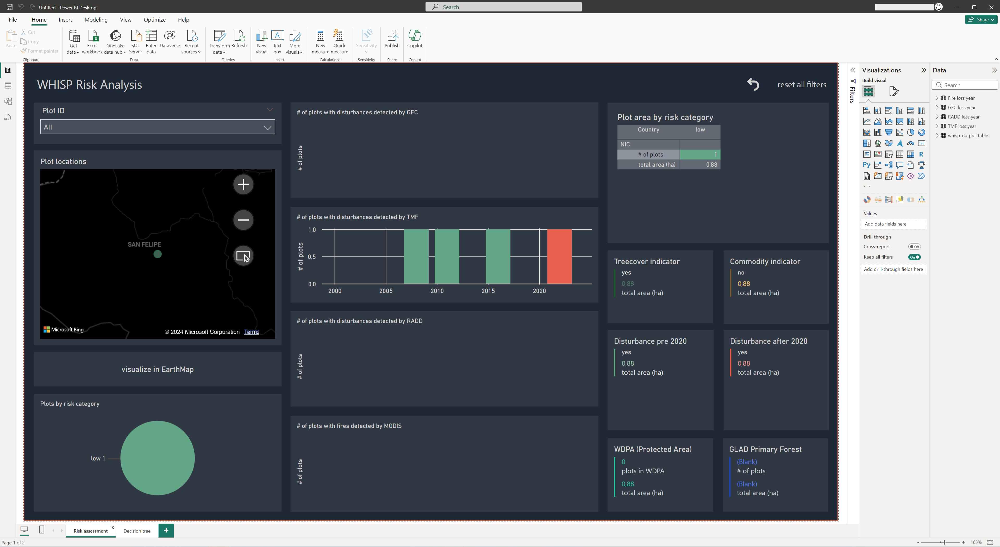
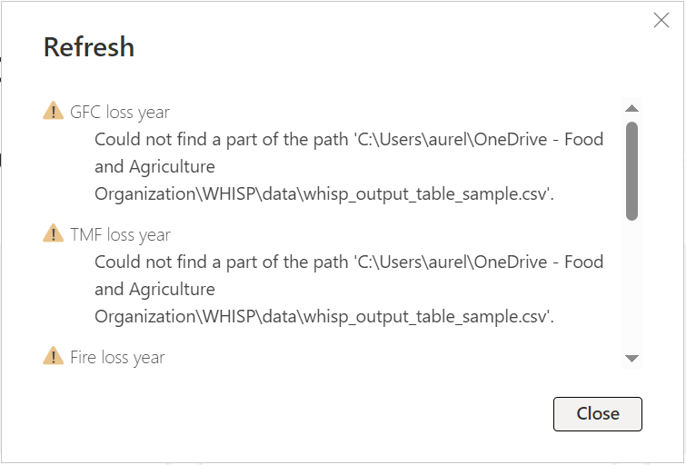
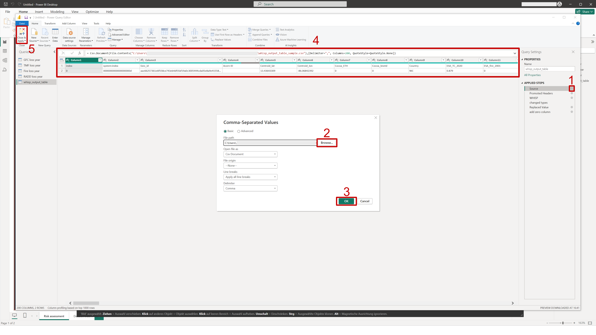

# Whisp Dashboards

The Whisp dashboard allows you to display statistics on deforestation risk in your plots in a **clear and understandable manner**.

Through the [Whisp App](https://whisp.openforis.org/submit-geometry), risk analysis of your plots based on openly available map material has been made easy and convenient. Upload your geometries as GeoJSONs in EPSG 4326 projection in the Whisp app and make sure to tick the box "Generate GeoIds". The output statistics from the Whisp App come in the well-established and interoperable CSV format that can be used for further analysis in a multitude of programs, including ***MS PowerBI***.

Here you can find a pre-programmed ***MS PowerBI*** dashboard that can be filled with your individual risk analysis outputs from Whisp App.   This dashboard will provide the user with a clear overview of deforestation risk according to different sources in their plot. 

Depending on your input, the dashboard will look something like this:

&nbsp;
&nbsp;
&nbsp;

## How to use it

&nbsp;
&nbsp;
&nbsp;

**First, download the PowerBI file [FAO_WHISP_RISK_EN_dark.pbit](FAO_WHISP_RISK_EN_dark.pbit). Then open it.**

&nbsp;
&nbsp;
&nbsp;

---

You will initially receive an error message looking similar to this:

---

Close the error message and you will see the yet unfilled dashboard: 

In order to fill it with data, go to the **Data** section on the right, and hover your cursor over **"whisp_output_table"** until you see the triple dots. 
1. Click the triple dots.
2. Click "Edit query".

---

Your are now in the Power Query Editor:

The **"APPLIED STEPS"** section shows what actions are taken to import and prepare the data for the dashboard.
1. Click the gear icon next to *"Source"* to open the data access window. This is pre-set to take CSV-Files. You can download an examplary file to your local drive **[here](assets/whisp_output_table_sample.csv)**.
2. Select this file from your local drive.
3. Press **"OK"**.
4. The data will now appear.
5. Finally, click **"Close & Apply"**.

---

You will now find your dashboard filled with data, looking something like this:

 
&nbsp;
&nbsp;
&nbsp;

The dashboard elements should refresh with your data. Save your output file under a new name.
***
**Happy WHISPing!**

 

