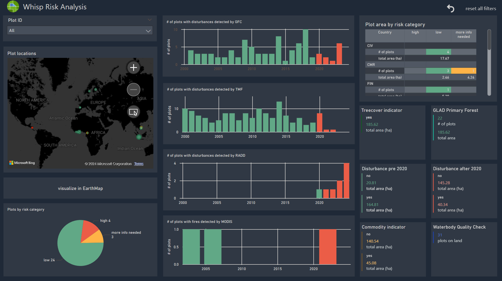

# Whisp Dashboards

&nbsp;

**Download and open the PowerBI file [FAO_WHISP_RISK_EN_dark 4.pbit](https://github.com/forestdatapartnership/whisp-dashboards/blob/a9af315c5a8839f40b0af3eb51e75917fd980569/FAO_WHISP_RISK_EN_dark%204.pbit).**

&nbsp;
&nbsp;
&nbsp;

---

You will initially receive this error message:

---

Close the error message and you will see the yet unfilled dashboard: 

In order to fill it with data, go to the **Data** section on the right, and hover your cursor over **"whisp_output_table"** until you see the triple dots. 
1. Click the triple dots.
2. Click "Edit query".

---

Your are now in the Power Query Editor:

The **"APPLIED STEPS"** section shows what actions are taken to import and prepare the data for the dashboard.
1. Click the gear icon next to *"Source"* to open the data access window. This is pre-set to take CSV-Files. You can download an examplary file to your local drive **[here](assets/whisp_output_table_sample.csv)**.
2. Select this file from your local drive.
3. Press **"OK"**.
4. The data will now appear.
5. Finally, click **"Close & Apply"**.

---

You will now find your dashboard filled with data, looking something like this:

 
&nbsp;
&nbsp;
&nbsp;

The dashboard elements should refresh with your data. Save your output file under a new name.
***
**Happy WHISPing!**

 

